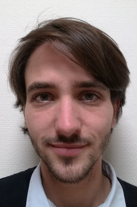

---
# You don't need to edit this file, it's empty on purpose.
# Edit theme's home layout instead if you wanna make some changes
# See: https://jekyllrb.com/docs/themes/#overriding-theme-defaults
layout: default
indexid: index
---

Depuis Septembre 2020, je suis **Attaché Temporaire d'Enseignement et de Recherche**
([ATER](https://fr.wikipedia.org/wiki/Attach%C3%A9_temporaire_d%27enseignement_et_de_recherche))
dans le département de mathématiques de l'[université de Versailles](http://www.uvsq.fr/).
Avant cela, je travaillais comme doctorant dans les équipes
[MIC2](https://www.infres.telecom-paristech.fr/wp/mic2/)
([INFRES](https://www.infres.telecom-paristech.fr/wp/) -
[Télécom Paris](https://www.telecom-paristech.fr/))
et [CRYPTO](http://lmv.math.cnrs.fr/teams/crypto/) ([LMV](http://lmv.math.cnrs.fr/) -
[Université de Versailles](http://www.uvsq.fr/)). J'ai commencé mon doctorat
en 2017, sous la supervision de [Luca De Feo](http://defeo.lu/),
[Hugues Randriambololona](http://perso.telecom-paristech.fr/~randriam/)
et [Éric Schost](https://cs.uwaterloo.ca/~eschost/).

Mon domaine de recherche se situe entre l'informatique et les mathématiques,
plus précisément à l'intersection entre
l'[**algorithmique**](https://fr.wikipedia.org/wiki/Algorithmique), la
[**cryptologie**](https://fr.wikipedia.org/wiki/Cryptologie), la 
[**théorie des nombres**](https://fr.wikipedia.org/wiki/Th%C3%A9orie_des_nombres
), et le [**calcul formel**](https://fr.wikipedia.org/wiki/Calcul_formel).
J'aime particulièrement
l'enseignement, que ce soit de l'informatique ou des mathématiques, et j'ai un
intérêt particulier pour les disciplines qui mêlent les deux.

N'hésitez pas à m'envoyer un [e-mail](mailto:{{ site.email }}) si vous
voulez en savoir plus !

## Articles

**Trisymmetric multiplication formulae in finite fields**
: WAIFI 2020
: *avec [Hugues Randriam](http://perso.telecom-paristech.fr/~randriam/).*

**[Standard Lattices of Compatibly Embedded Finite Fields](https://hal.archives-ouvertes.fr/hal-02136976)**
: ISSAC 2019
: *avec [Luca De Feo](http://defeo.lu/) et [Hugues Randriam](http://perso.telecom-paristech.fr/~randriam/).*

## Logiciels

J'aime jouer avec [Sage](http://www.sagemath.org/) et
[Nemo](http://nemocas.org/)/[Flint](http://flintlib.org/) et j'ai développé
quelques logiciels basés sur ces bibliothèques. Vous trouverez plus de
détails, dont le code source, sur [Github](https://github.com/erou?tab=repositories).

[**TriSym**](https://github.com/erou/TriSym.jl)
: Une bibliothèque Julia/Nemo pour calculer des formules 
trisymmétriques pour la multiplication dans les corps finis.

[**LatticeGFH90**](https://github.com/erou/LatticeGFH90.jl)
: Une bibliothèque Julia/Nemo pour calculer des réseaux d'extensions compatibles
de corps finis.

[**DlogGF**](https://github.com/erou/DlogGF.jl)
: Une bibliothèque Julia/Nemo pour calculer des logarithmes discrets dans les
corps finis.

[**normalBases**](https://github.com/erou/normalBases)
: Une bibliothèque basée sur Flint pour calculer des bases normales dans les
corps finis.

## Enseignement

Vous trouverez plus de détails sur la [page dédiée](teaching).

2020 -- 2021
: Analyse (L1) (Université de Versailles, 108h)
: [Colleur](teaching/colles) (Lycée Robert Doisneau et lycée du parc des Loges)

2019 -- 2020
: [Cryptographie (L3)](teaching/crypto-l3) (Université de Versailles, 36h)
: Introduction à la programmation (L1) (Université de Versailles, 30h)

2017 -- 2019
: [Cryptographie (L3)](teaching/crypto-l3) (Université de Versailles, 72h)
: [Cryptographie (M1)](teaching/crypto-m1) (Université de Versailles, 72h)

2016 -- 2017
: [Colleur](teaching/colles) (Lycée Jacques Prévert, 36h)

2013 -- 2014
: Tuteur en mathématiques (Université Paris-Sud, 30h)

## Exposés

* [Trisymmetric multiplication formulae in finite fields](talk-waifi.pdf)
  (Juillet 2020, WAIFI 2020)
* [**Standard lattices of compatibly embedded finite
  fields**](talk-issac2019.pdf)
  (Juillet 2019, ISSAC'19)
* [**Standard lattices of compatibly embedded finite fields**](talk-uvsq.pdf)
  (Mai 2019, UVSQ)
* [**Standard lattices of compatibly embedded finite fields**](talk-jncf.pdf)
  (Février 2019, JNCF)
* [**Présentation informelle de ma thèse**](talk-dim.pdf) (Novembre 2018, Math Innov' day)
* [**Latices of compatibly embedded finite fields in Nemo/Flint**](https://mybinder.org/v2/gh/erou/Nemo-embeddings-demo/master?filepath=demo.ipynb) (Juillet 2018, ISSAC'18)
* [**Lattices of compatibly embedded finite fields**](talk-gtbac.pdf) (Decembre 2017, GT BAC,
  Télécom Paris)
* **Discrete logarithm in finite field of small characteristic** (Octobre
  2017, Magistère, Université Paris-Sud)
* **Discrete logarithm in finite field of small characteristic** (Septembre
  2017, Soutenance de M2, Université de Versailles)
* **Discrete logarithm in finite field of small characteristic** (Septembre
  2017, University of Waterloo)

## Intérêts divers

Je pratique aussi le **théâtre d'improvisation**, c'est pourquoi vous
trouverez des [ressources](impro) à propos de cours que j'ai donné.
